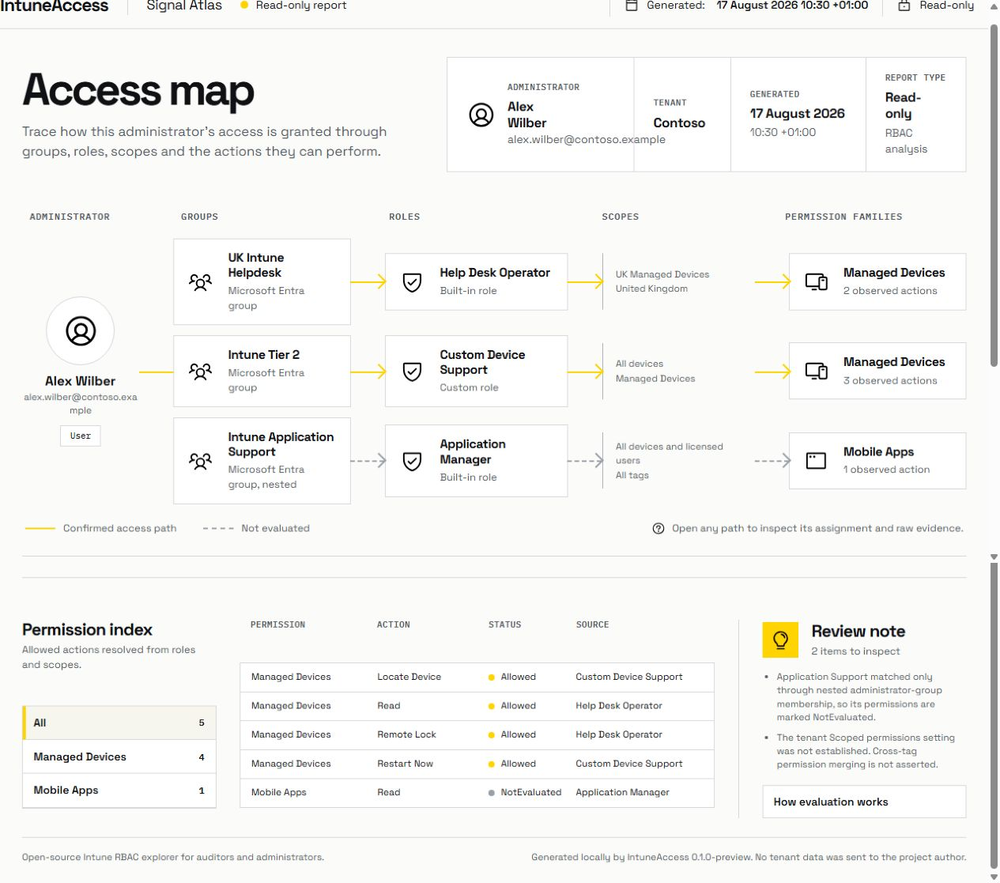

# IntuneAccess

IntuneAccess is an open source, read only PowerShell module that connects Microsoft Intune administration, workload targeting and evidence in one local report. It joins objects that are usually inspected one at a time: administrators, Microsoft Entra groups, Intune roles, scopes, configuration and compliance policies, endpoint security, applications, scripts, updates, targets and assignment filters.

The main result is a PowerShell object with an evidence trail. A self contained HTML report is available when a human readable record is needed.

IntuneAccess is an independent community project and is not affiliated with, endorsed by, or supported by Microsoft.

## Why IntuneAccess exists

The Intune admin centre exposes rich object-specific views, but common investigations still require an administrator to cross-reference separate pages and exports. IntuneAccess performs that correlation without changing the tenant or sending tenant data to a hosted service.

Its evidence chain is:

```text
Who can change it > who should receive it > what Intune reported > where the evidence stops
```

It is designed for administrators who need to establish:

1. Which Intune role assignments apply to a person.
2. Which exact Graph actions those roles allow.
3. Which Admin Groups supplied each assignment.
4. Which scope groups and scope tags constrain each assignment.
5. Which conclusions are confirmed and which remain `NotEvaluated`.
6. Which policies, applications, scripts and updates target each group, broad audience or assignment filter.
7. Whether an apparent absence is a real empty result, an explicit exclusion, a missing permission or an unavailable Graph endpoint.
8. What changed between two local snapshots and which broad target could be affected.
9. Which supported policies set the same definition to different values on a confirmed overlapping target.

## What it does

1. Reads built in and custom role definitions from Microsoft Graph.
2. Preserves every source when two assignments allow the same action.
3. Returns structured PowerShell objects.
4. Follows Graph pagination and retries throttled or transient reads.
5. Produces a local, offline HTML report with no remote assets or tracking.
6. Audits a documented base or extended set of scope tag relationships.
7. Provides a conservative managed device access explanation.
8. Compares legacy merged and Scoped permissions behaviour without guessing the tenant setting.
9. Compares two administrators and identifies different permission evidence.
10. Exports complete JSON evidence or flattened CSV datasets.
11. Collects configuration, compliance, endpoint security, application, script, remediation and Windows update assignments.
12. Separates confirmed assignment configuration from device or user deployment outcomes.
13. Records v1.0 or beta API provenance and a collection state for every workload family.
14. Builds Device 360 and User 360 views from managed-device identity and supported reported outcomes.
15. Preserves reported state, detail, last-reported time and decimal plus hexadecimal error codes.
16. Saves integrity-checked local snapshots and compares added, removed and modified evidence.
17. Offers stable identity pseudonymisation for share-safe snapshot workflows.
18. Finds same-setting overlaps and labels only evidence-backed cases as potential conflicts.
19. Shows recent Intune audit events and links resource IDs to matching snapshot changes.

## What it does not do

1. It does not create, edit or delete Intune configuration.
2. It does not request Graph write permissions.
3. It does not evaluate Microsoft Entra administrative roles.
4. It does not claim that a missing RBAC path proves access is denied.
5. It does not upload tenant data.

## Example

For the guided end-user workflow, install the module and run one command:

```powershell
Install-Module -Name IntuneAccess -Scope CurrentUser

Start-IntuneAccess
```

After sign-in, IntuneAccess collects Intune RBAC relationships, workload assignments, supported outcomes and supported policy settings. It creates the Signal Atlas HTML explorer in Documents and opens it in the default browser.

Supply an account when you want that administrator selected initially:

```powershell
Start-IntuneAccess `
    -UserPrincipalName 'helpdesk.user@contoso.com'
```

For structured objects and advanced analysis, use the individual commands:

```powershell
Import-Module IntuneAccess

Connect-IntuneAccess

$assignments = Get-IntuneAssignmentImpact
$assignments.Workloads
$assignments.Assignments

$device = Get-IntuneDevice360 -DeviceName 'LAPTOP-0234'
$device.DeploymentOutcomes

$user = Get-IntuneUser360 -UserPrincipalName 'helpdesk.user@contoso.com'
$user.ManagedDevices

$conflicts = Get-IntunePolicyConflict
$conflicts.PotentialConflicts

$access = Get-IntuneAdminAccess `
    -UserPrincipalName 'helpdesk.user@contoso.com'

$access.RoleAssignments
$access.EffectivePermissions
$access.ScopeGroups
$access.ScopeTags

$impact = $access | Get-IntuneScopedPermissionImpact
$impact.Rows

$access | Export-IntuneAccessReport `
    -Path '.\helpdesk-user-intune-access.html'

$access | Export-IntuneAccessData `
    -Path '.\helpdesk-user-intune-access.json' `
    -Format Json

Start-IntuneAccess `
    -SnapshotPath '.\current.snapshot.json' `
    -BaselineSnapshotPath '.\baseline.snapshot.json'
```

For scope tag auditing or managed device access checks, reconnect with the required read only feature scopes:

```powershell
Connect-IntuneAccess -Feature Core, ScopeTagAudit, ManagedDeviceAccess

Get-IntuneScopeTagAudit

Test-IntuneResourceAccess `
    -UserPrincipalName 'helpdesk.user@contoso.com' `
    -DeviceName 'LAPTOP-0234'
```

## Screenshot



## Requirements

1. PowerShell 7 or later.
2. An Intune licensed tenant.
3. The `Microsoft.Graph.Authentication` module, version 2 or later.
4. Delegated Graph consent for the selected features.
5. A work or school account with sufficient Intune rights to read the requested tenant data.

Install the authentication module if needed:

```powershell
Install-PSResource Microsoft.Graph.Authentication -Scope CurrentUser -TrustRepository
```

## Graph permissions

Core analysis requests:

```text
User.Read
User.Read.All
GroupMember.Read.All
DeviceManagementRBAC.Read.All
```

The guided Assignment Explorer also requests:

```text
DeviceManagementConfiguration.Read.All
DeviceManagementApps.Read.All
DeviceManagementScripts.Read.All
```

Device and User 360 add:

```text
DeviceManagementManagedDevices.Read.All
```

The other operational outcome endpoints use the configuration, application and script read scopes already listed. To omit operational collection, run:

```powershell
Start-IntuneAccess -Feature Core, AssignmentExplorer
```

The recent Audit Trail uses `DeviceManagementApps.Read.All`, already requested by the default Assignment Explorer. Audit collection can be omitted by supplying an explicit feature list without `AuditEvidence`.

Scope tag auditing adds:

```text
DeviceManagementConfiguration.Read.All
DeviceManagementApps.Read.All
```

Extended scope-tag auditing also adds:

```text
DeviceManagementScripts.Read.All
```

Managed device explanation adds:

```text
DeviceManagementManagedDevices.Read.All
Device.Read.All
```

Every requested permission ends in `Read` or `Read.All`. See [docs/permissions.md](docs/permissions.md) for the endpoint matrix and consent notes.

## Installation

Install IntuneAccess from the PowerShell Gallery in PowerShell 7 or later:

```powershell
Install-Module -Name IntuneAccess -Scope CurrentUser
```

Then start the guided workflow:

```powershell
Start-IntuneAccess
```

The manifest declares `Microsoft.Graph.Authentication` version 2.0.0 or later as a dependency. See the [IntuneAccess package page](https://www.powershellgallery.com/packages/IntuneAccess) for the published metadata.

## Guided report

`Start-IntuneAccess` provides the shortest end-user route. It:

1. Opens delegated Microsoft Graph sign-in.
2. Reads Intune RBAC role assignments and their connected objects.
3. Enumerates users only from the resolved Admin Groups on those assignments.
4. Generates a self-contained Signal Atlas HTML explorer in Documents.
5. Opens the explorer in the default browser.
6. Lets the user move between RBAC, assignments, devices, users, outcomes, policy settings, conflict findings and snapshot changes without returning to PowerShell.

Use parameters when scripting or selecting the target in advance:

```powershell
Start-IntuneAccess `
    -UserPrincipalName 'admin@contoso.com' `
    -NoOpen
```

## Connect

`Connect-IntuneAccess` uses interactive delegated authentication. It shows the tenant, account and granted scopes after connection. Consent requirements are not hidden.

```powershell
Connect-IntuneAccess
```

Personal Microsoft accounts are not supported.

## Analyse an administrator

Use either a user principal name or a Microsoft Entra object ID:

```powershell
Get-IntuneAdminAccess -UserPrincipalName 'admin@contoso.com'

Get-IntuneAdminAccess `
    -UserId '00000000-0000-0000-0000-000000000000'
```

The returned object contains `User`, `Tenant`, `RoleAssignments`, `EffectivePermissions`, `AdminGroups`, `ScopeGroups`, `ScopeTags`, `Warnings`, `Evidence`, `GeneratedAt` and `ToolVersion`.

## Compare administrators

Compare two live analyses or two existing result objects:

```powershell
Compare-IntuneAdminAccess `
    -ReferenceUser 'senioradmin@contoso.com' `
    -DifferenceUser 'helpdesk@contoso.com'

Compare-IntuneAdminAccess `
    -ReferenceObject $seniorAccess `
    -DifferenceObject $helpdeskAccess
```

The comparison covers role assignments, exact Graph actions, Admin Groups, Scope Groups and Scope Tags. A shared permission is marked `DifferentEvidence` when different assignments supply it.

## Assess Scoped permissions impact

```powershell
$impact = $access | Get-IntuneScopedPermissionImpact
$impact.Rows | Format-Table Resource, ScopeTagName, Operation, LegacyState, ScopedState, Change
```

The default tenant mode is `Unknown`. Both documented models are returned, but `EffectiveState` remains `NotEvaluated` until the caller explicitly supplies `LegacyMerged` or `Scoped`:

```powershell
$access | Get-IntuneScopedPermissionImpact -TenantMode Scoped
```

This parameter is an explicit statement by the caller. It is not tenant-mode detection.

## Export structured evidence

Export a complete JSON evidence envelope:

```powershell
$access | Export-IntuneAccessData `
    -Path '.\access-snapshot.json' `
    -Format Json
```

Export flattened CSV datasets:

```powershell
$access | Export-IntuneAccessData `
    -Path '.\access-csv' `
    -Format Csv
```

CSV export writes summary, role assignment, permission, group, scope tag, warning and evidence datasets.

## Export an HTML report

```powershell
$access | Export-IntuneAccessReport -Path '.\IntuneAccess.html'
```

The report contains sensitive administrative information. It can include usernames, group names and RBAC configuration. Store and share it with the same care as other tenant administration exports.

## Scope tag audit

The base audit examines role assignments, classic device configurations and mobile apps. Findings use `Information` and `Review` severities. They are observations, not vulnerability claims.

```powershell
Connect-IntuneAccess -Feature Core, ScopeTagAudit
Get-IntuneScopeTagAudit
```

The extended audit adds compliance policies, Settings Catalog and endpoint security policies, remediations and device health scripts:

```powershell
Connect-IntuneAccess -Feature Core, ExtendedScopeTagAudit
Get-IntuneScopeTagAudit -IncludeExtendedResources
```

## How effective access is calculated

IntuneAccess keeps three layers:

1. Source: the Graph object and its raw ID.
2. Evidence: an observed relationship between sources.
3. Conclusion: an exact action marked `Allowed` or `NotEvaluated`.

Confirmed assignments are unioned by the exact action returned in the role definition. No built in role permission table is treated as authoritative.

Microsoft introduced an opt in Scoped permissions behaviour in March 2026. The documented Graph contracts used by IntuneAccess do not expose a dependable tenant setting for it. `Get-IntuneScopedPermissionImpact` models both documented behaviours from the observed assignments. It does not select the active behaviour unless the caller supplies the tenant mode.

See [docs/effective-access-model.md](docs/effective-access-model.md).

## Known limitations

1. Assignment scope tag IDs, scope type and audited resource tag IDs require isolated Microsoft Graph beta reads. Stable assignment identity, Admin Groups and Scope (Groups) come from v1.0 and remain available if beta enrichment fails.
2. Nested Admin Group membership can depend on Intune licensing and tenant configuration. Nested only paths are marked `NotEvaluated`.
3. Microsoft Entra roles, including Intune Administrator, are not evaluated.
4. Hidden Microsoft Entra group membership is not read because the default connection does not request `Member.Read.Hidden`.
5. Managed device access explanation is deliberately conservative and never returns `AccessDenied`.
6. Scope tag auditing covers a defined set of resource families rather than every Intune object type.
7. Settings Catalog and endpoint security policy settings use isolated Microsoft Graph beta contracts.
8. Exact intersection between different target groups and assignment-filter rule evaluation are not calculated; those overlaps remain `NotEvaluated`.
9. A configured assignment does not prove delivery, and a reported outcome does not prove which assignment produced it.
10. Supported legacy configuration status and beta application status contracts are deprecated by Microsoft; each read is isolated and labelled.
11. Settings Catalog, endpoint security and Windows update deployment outcomes remain unsupported until a dependable read contract is adopted.
12. Identity redaction creates stable pseudonyms, not irreversible anonymisation.
13. A live tenant is required to validate tenant specific behaviour.

See [docs/limitations.md](docs/limitations.md).

The current requirement-by-requirement status is recorded in [docs/completion-audit.md](docs/completion-audit.md).

Product decisions, design choices, validation evidence and release progress are tracked in [docs/project-log.md](docs/project-log.md).

The agreed versioned product plan is tracked in [docs/roadmap.md](docs/roadmap.md).

Research into current Intune gaps and candidate product opportunities is recorded in [docs/product-opportunities.md](docs/product-opportunities.md).

Recent community problem research and the IntuneAccess value proposition are recorded in [docs/community-research.md](docs/community-research.md).

The current release notes are available in [RELEASE_NOTES.md](RELEASE_NOTES.md).

## Security and privacy

IntuneAccess does not send tenant data to the project author. Microsoft Graph data is processed locally in the PowerShell session.

The module has no telemetry, analytics, hosted service, persistent tenant cache or credential store. Access tokens are not written to reports or logs. See [SECURITY.md](SECURITY.md).

## Microsoft documentation

The implementation and documentation were checked against Microsoft Learn on 17 August 2026.

1. [Assign Microsoft Intune roles](https://learn.microsoft.com/en-us/intune/fundamentals/role-based-access-control/assign-role)
2. [Use RBAC and scope tags for distributed IT](https://learn.microsoft.com/en-us/intune/fundamentals/role-based-access-control/scope-tags)
3. [List Intune role definitions](https://learn.microsoft.com/en-us/graph/api/intune-rbac-deviceandappmanagementroledefinition-list?view=graph-rest-1.0)
4. [List Intune role assignments](https://learn.microsoft.com/en-us/graph/api/intune-rbac-deviceandappmanagementroleassignment-list?view=graph-rest-1.0)
5. [List a user's direct and transitive memberships](https://learn.microsoft.com/en-us/graph/api/user-list-transitivememberof?view=graph-rest-1.0)

## Contributing

Bug reports and focused pull requests are welcome. Read [CONTRIBUTING.md](CONTRIBUTING.md) before sharing logs or sample Graph data.

## Licence

IntuneAccess is licensed under the [MIT Licence](LICENSE).

Bundled font and icon licences are recorded in [THIRD-PARTY-NOTICES.md](THIRD-PARTY-NOTICES.md).
